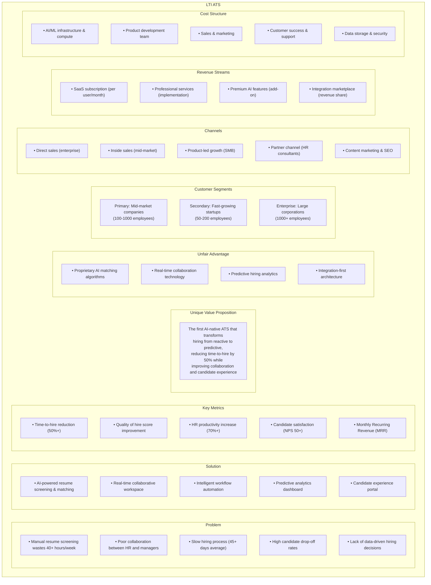
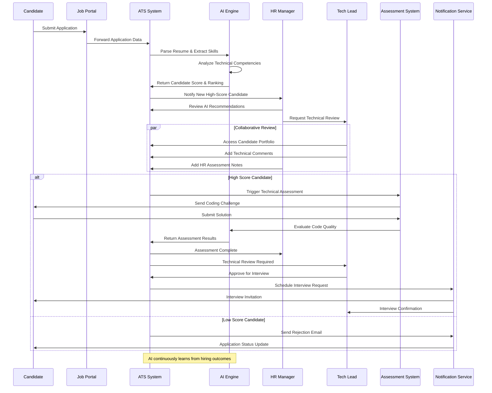
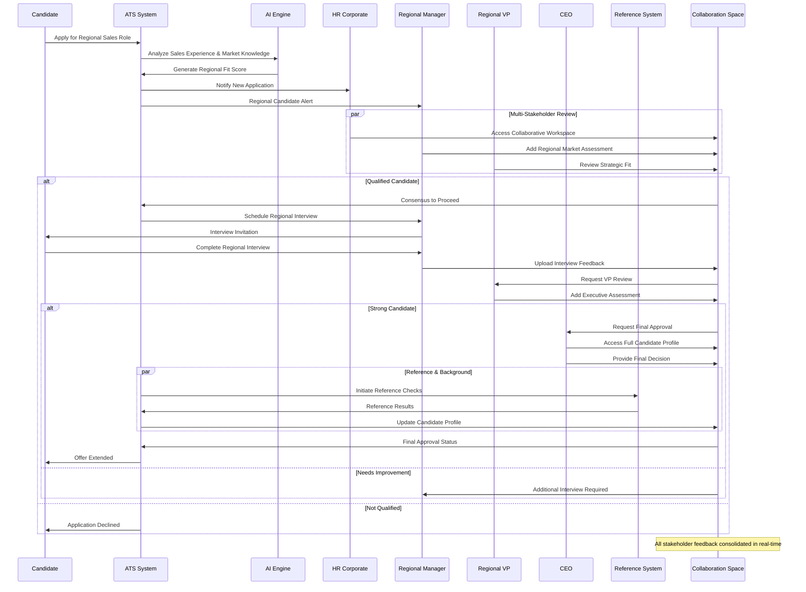
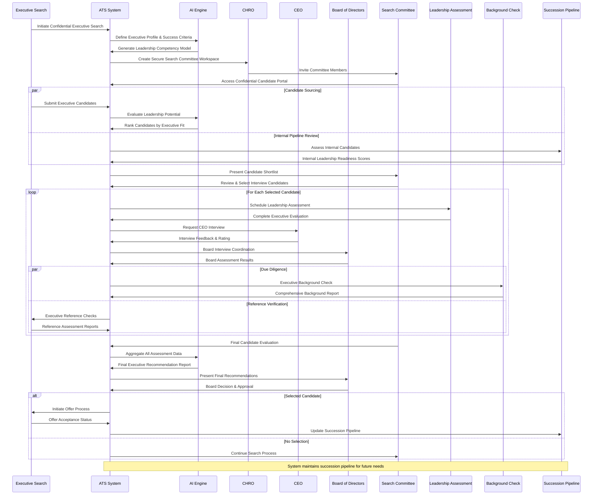
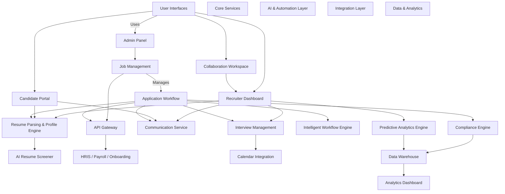
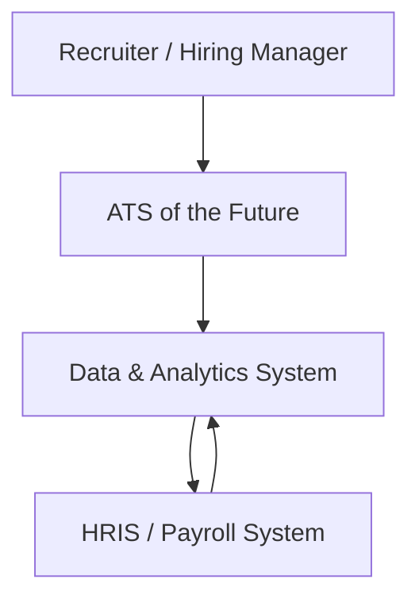
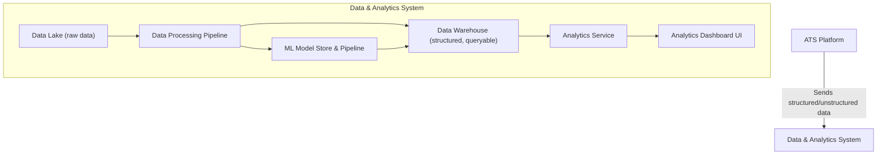
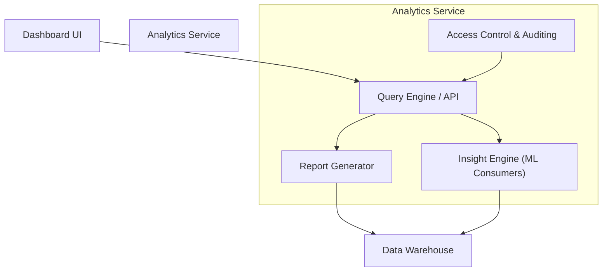

# LTI ATS

## Overview

LTI ATS represents a paradigm shift from traditional applicant tracking to an AI-native hiring intelligence platform. Built around four core pillars—enhanced HR efficiency, real-time collaboration, intelligent automation, and AI assistance—this system transforms manual, time-consuming recruitment processes into streamlined, data-driven workflows. The platform features proprietary AI algorithms that automatically screen and rank candidates, reducing resume review time by 80%, while providing predictive analytics that forecast candidate success probability and optimal hiring timelines. Real-time collaborative workspaces enable seamless interaction between HR teams and hiring managers, eliminating the communication bottlenecks that typically slow down hiring decisions.

Beyond efficiency gains, the system creates sustainable competitive advantages through its integration-first architecture, continuous learning AI engine, and comprehensive analytics dashboard that turns hiring into a strategic business function. The platform serves mid-market companies as its primary segment, delivering measurable ROI through 50-70% reduction in time-to-hire, improved qusality of hire scores, and enhanced candidate experience that strengthens employer branding. With multiple revenue streams including SaaS subscriptions, professional services, and premium AI features, the system positions itself as the definitive solution for organizations seeking to transform their hiring from a reactive administrative function into a predictive, collaborative, and strategically valuable business capability.

## Competitive advantadges

1. Proprietary AI & Machine Learning Engine
2. Real-Time Collaboration Infrastructure
3. Integration-First Architecture

## Added value

**Quantified Benefits:**

* **Time Savings:** 50-70% reduction in time-to-hire
* **Quality Improvement: **25-40% improvement in new hire performance scores
* **Cost Reduction:** 40-60% lower cost-per-hire through efficiency gains
* **Experience Enhancement:** 80% improvement in candidate satisfaction scores
* **Collaboration Efficiency:** 90% reduction in email exchanges during hiring process

**Strategic Value:**

* **Competitive Talent Acquisition:** Faster hiring enables capturing top candidates before competitors
* **Employer Brand Enhancement:** Superior candidate experience improves company reputation
* **Scalability:** System grows with company needs without proportional complexity increase
* **Risk Mitigation:** Built-in compliance and bias detection reduce legal exposure

## Lean Canvas Diagram

## Top 3 Uses Cases

### High-Volume Technical Recruiting

**Scenario:** A fast-growing SaaS company needs to hire 50 software engineers across multiple specializations (frontend, backend, DevOps, data science) within 6 months to support product expansion.
Challenge:

* Receiving 200+ applications per role with varying technical skill sets
* Technical hiring managers have limited time for initial screening
* Need to assess both technical competency and cultural fit
* Competition for talent requires fast decision-making

**Solution Value:**

* **AI Resume Screening:** Automatically parses technical skills, experience levels, and project portfolios, ranking candidates by role-specific criteria
* **Predictive Matching:** AI analyzes successful past hires to identify patterns and score new candidates' likelihood of success
* **Collaborative Technical Review:** Engineering leads can simultaneously review code samples and provide real-time feedback
* **Automated Workflow: **Triggers technical assessments, schedules pair programming sessions, and manages offer negotiations

**Outcome:** 60% reduction in time-to-hire, 40% improvement in technical hire success rates, and ability to compete effectively for top talent.

#### UML Diagram

###  Multi-Location Team Expansion

Scenario: A B2B company expanding into 5 new markets needs to hire regional sales managers and account executives, each requiring specific local market knowledge and cultural understanding.

**Challenge:**

* Different hiring managers across locations with varying experience levels
* Need consistent evaluation criteria while respecting local nuances
* High-stakes hires where wrong decisions cost significant revenue
* Coordinating feedback from multiple stakeholders (regional VPs, HR, CEO)

**Solution Value:**

* **Standardized Evaluation Process: **AI ensures consistent scoring criteria across all locations while allowing for regional customization
* **Real-Time Collaboration:** Regional managers, HR, and executives can simultaneously evaluate candidates with live commenting and scoring
* **Predictive Sales Performance:** AI analyzes past successful sales hires to identify key indicators of future performance
* **Automated Reference Checks:** Streamlines background verification and reference collection across different time zones

**Outcome:** 45% faster hiring process, improved quality of sales hires leading to 25% better first-year performance, and standardized hiring excellence across all regions.

#### UML Diagram

### Executive Leadership Succession Planning

**Scenario:** A manufacturing company needs to replace their retiring Chief Operations Officer while also building a pipeline for other C-level succession planning.

**Challenge:**

* Limited pool of qualified executive candidates
* Complex stakeholder involvement (board members, current executives, key clients)
* Confidential search process requiring discretion
* Need for cultural fit assessment and leadership potential evaluation
* Long decision timeline with multiple interview rounds

**Solution Value:**

* **Executive Search Workflow:** Specialized pipelines for confidential, high-touch recruitment processes
* **Stakeholder Coordination:** Secure collaboration spaces for board members and executives with audit trails
* **Leadership Assessment Integration:** AI-powered analysis of leadership competencies, cultural alignment, and strategic thinking capabilities
* **Succession Pipeline Management:** Tracks and nurtures potential internal and external candidates for future leadership roles

**Outcome:** 30% reduction in executive search timeline, improved stakeholder alignment through transparent evaluation processes, and establishment of robust succession planning pipeline for long-term organizational stability.

#### UML Diagram

## Data Model

```mermaid
erDiagram
    %% Core Organization & User Management
    ORGANIZATION {
        int organization_id PK
        string name
        string domain
        json settings
        string subscription_tier
        datetime created_at
        boolean active
    }
    
    USER {
        int user_id PK
        int organization_id FK
        string email
        string first_name
        string last_name
        string role
        json permissions
        string department
        string region
        datetime created_at
        boolean active
    }
    
    %% Job Management
    JOB_POSTING {
        int job_id PK
        int organization_id FK
        string title
        string department
        string job_type
        string level
        string region
        string location
        text description
        json requirements
        json technical_skills
        json benefits
        decimal salary_min
        decimal salary_max
        string status
        datetime created_at
        datetime expires_at
        int created_by FK
    }
    
    %% Candidate Management
    CANDIDATE {
        int candidate_id PK
        string first_name
        string last_name
        string email
        string phone
        string current_location
        boolean willing_to_relocate
        text resume_text
        json parsed_resume
        string linkedin_url
        string github_url
        string portfolio_url
        json experience_summary
        datetime profile_created
        string source
        boolean blacklisted
    }
    
    %% Application Process
    APPLICATION {
        int application_id PK
        int candidate_id FK
        int job_id FK
        string status
        string source
        datetime submitted_at
        datetime last_updated
        json cover_letter_data
        json additional_documents
        string current_stage
        int assigned_recruiter FK
        json custom_fields
    }
    
    %% Skills Management
    SKILL {
        int skill_id PK
        string skill_name
        string category
        string skill_type
        json metadata
    }
    
    CANDIDATE_SKILL {
        int candidate_skill_id PK
        int candidate_id FK
        int skill_id FK
        int years_experience
        string proficiency_level
        boolean verified
        string verification_source
    }
    
    JOB_SKILL_REQUIREMENT {
        int requirement_id PK
        int job_id FK
        int skill_id FK
        string importance_level
        int min_years_required
        string proficiency_required
    }
    
    %% AI Scoring & Assessment
    AI_SCORE {
        int score_id PK
        int application_id FK
        float overall_score
        float skill_match_score
        float experience_score
        float cultural_fit_score
        json detailed_breakdown
        text reasoning
        string model_version
        datetime scored_at
        boolean needs_update
    }
    
    ASSESSMENT {
        int assessment_id PK
        int application_id FK
        string assessment_type
        string category
        text description
        json questions
        text candidate_response
        datetime sent_at
        datetime submitted_at
        string status
        int time_limit_minutes
    }
    
    ASSESSMENT_RESULT {
        int result_id PK
        int assessment_id FK
        float score
        json detailed_results
        json metrics
        text ai_feedback
        datetime evaluated_at
        string evaluation_method
    }
    
    %% Interview Management
    INTERVIEW {
        int interview_id PK
        int application_id FK
        string interview_type
        string round_level
        datetime scheduled_at
        int duration_minutes
        string status
        string meeting_link
        json participants
        text notes
        json ratings
        string recommendation
        datetime completed_at
    }
    
    INTERVIEW_PARTICIPANT {
        int participant_id PK
        int interview_id FK
        int user_id FK
        string role
        boolean required
        string status
        text feedback
        json ratings
    }
    
    %% Collaboration & Review System
    COLLABORATION_SESSION {
        int session_id PK
        int application_id FK
        string session_name
        string session_type
        datetime created_at
        datetime last_activity
        string status
        json participants
        boolean confidential
    }
    
    REVIEW {
        int review_id PK
        int application_id FK
        int session_id FK
        int reviewer_id FK
        string review_type
        float rating
        text comments
        string recommendation
        json criteria_scores
        datetime submitted_at
        boolean is_final
    }
    
    COMMENT {
        int comment_id PK
        int application_id FK
        int session_id FK
        int user_id FK
        int parent_comment_id FK
        text content
        datetime created_at
        boolean resolved
        string visibility_level
    }
    
    %% Executive Search Specific
    EXECUTIVE_SEARCH {
        int search_id PK
        int organization_id FK
        string position_title
        string search_type
        string confidentiality_level
        json success_criteria
        json leadership_requirements
        decimal compensation_range
        datetime search_initiated
        string search_status
        int assigned_recruiter FK
        json board_requirements
    }
    
    SEARCH_COMMITTEE {
        int committee_id PK
        int search_id FK
        string committee_name
        string committee_chair
        datetime formed_at
        json approval_process
    }
    
    COMMITTEE_MEMBER {
        int member_id PK
        int committee_id FK
        int user_id FK
        string role_type
        json voting_permissions
        boolean board_member
        datetime joined_at
    }
    
    SUCCESSION_PIPELINE {
        int pipeline_id PK
        int organization_id FK
        string position_category
        string succession_tier
        json development_plans
        datetime last_updated
        string status
    }
    
    PIPELINE_CANDIDATE {
        int pipeline_candidate_id PK
        int pipeline_id FK
        int candidate_id FK
        string readiness_level
        json development_needs
        datetime target_ready_date
        float succession_probability
    }
    
    %% Regional/Multi-Location Support
    REGION {
        int region_id PK
        int organization_id FK
        string region_name
        string country
        string timezone
        json local_requirements
        json market_data
    }
    
    REGIONAL_ASSESSMENT {
        int assessment_id PK
        int application_id FK
        int region_id FK
        float market_knowledge_score
        float cultural_fit_score
        float local_experience_score
        json regional_criteria
        text assessment_notes
    }
    
    %% Reference & Background Checks
    REFERENCE_CHECK {
        int reference_id PK
        int application_id FK
        string reference_name
        string reference_title
        string reference_company
        string reference_email
        string reference_phone
        string relationship_type
        float reference_rating
        text reference_comments
        datetime requested_at
        datetime completed_at
        string status
        boolean verified
    }
    
    BACKGROUND_CHECK {
        int background_id PK
        int application_id FK
        string check_type
        string verification_level
        json check_results
        string clearance_status
        datetime initiated_at
        datetime completed_at
        string provider
        decimal cost
    }
    
    %% Workflow & Automation
    WORKFLOW_TEMPLATE {
        int template_id PK
        int organization_id FK
        string name
        string job_type
        json stages
        json automation_rules
        boolean active
        datetime created_at
    }
    
    WORKFLOW_INSTANCE {
        int instance_id PK
        int application_id FK
        int template_id FK
        string current_stage
        json stage_history
        json automation_log
        datetime started_at
        datetime last_updated
    }
    
    AUTOMATION_RULE {
        int rule_id PK
        int organization_id FK
        string name
        string trigger_event
        json conditions
        json actions
        boolean active
        datetime created_at
    }
    
    %% Communication & Notifications
    COMMUNICATION {
        int communication_id PK
        int application_id FK
        int sender_id FK
        string recipient_type
        string recipient_email
        string communication_type
        string subject
        text content
        datetime sent_at
        boolean delivered
        boolean opened
        json metadata
    }
    
    NOTIFICATION {
        int notification_id PK
        int user_id FK
        int application_id FK
        string type
        string title
        text message
        datetime created_at
        boolean read
        json action_data
    }
    
    %% Audit & Security
    AUDIT_LOG {
        int log_id PK
        int user_id FK
        int application_id FK
        string action
        string entity_type
        int entity_id
        json old_values
        json new_values
        datetime timestamp
        string ip_address
        string user_agent
    }
    
    CONFIDENTIALITY_LOG {
        int log_id PK
        int search_id FK
        int user_id FK
        string access_type
        string activity_description
        datetime access_time
        string ip_address
        json additional_data
    }
    
    %% Reporting & Analytics
    HIRING_METRICS {
        int metric_id PK
        int organization_id FK
        string metric_type
        json metric_data
        string period
        datetime calculated_at
        json filters_applied
    }
    
    %% Relationships
    ORGANIZATION ||--o{ USER : "employs"
    ORGANIZATION ||--o{ JOB_POSTING : "creates"
    ORGANIZATION ||--o{ REGION : "operates_in"
    USER ||--o{ JOB_POSTING : "creates"
    USER ||--o{ INTERVIEW_PARTICIPANT : "participates_in"
    USER ||--o{ REVIEW : "provides"
    USER ||--o{ COMMENT : "writes"
    
    JOB_POSTING ||--o{ APPLICATION : "receives"
    JOB_POSTING ||--o{ JOB_SKILL_REQUIREMENT : "requires"
    
    CANDIDATE ||--o{ APPLICATION : "submits"
    CANDIDATE ||--o{ CANDIDATE_SKILL : "has"
    CANDIDATE ||--o{ PIPELINE_CANDIDATE : "may_be_in"
    
    APPLICATION ||--|| AI_SCORE : "receives"
    APPLICATION ||--o{ ASSESSMENT : "takes"
    APPLICATION ||--o{ INTERVIEW : "leads_to"
    APPLICATION ||--o{ COLLABORATION_SESSION : "creates"
    APPLICATION ||--o{ REVIEW : "receives"
    APPLICATION ||--o{ REFERENCE_CHECK : "requires"
    APPLICATION ||--o{ BACKGROUND_CHECK : "undergoes"
    APPLICATION ||--o{ REGIONAL_ASSESSMENT : "may_have"
    APPLICATION ||--|| WORKFLOW_INSTANCE : "follows"
    
    SKILL ||--o{ CANDIDATE_SKILL : "defines"
    SKILL ||--o{ JOB_SKILL_REQUIREMENT : "required_for"
    
    ASSESSMENT ||--|| ASSESSMENT_RESULT : "produces"
    INTERVIEW ||--o{ INTERVIEW_PARTICIPANT : "includes"
    COLLABORATION_SESSION ||--o{ REVIEW : "contains"
    COLLABORATION_SESSION ||--o{ COMMENT : "enables"
    
    EXECUTIVE_SEARCH ||--|| SEARCH_COMMITTEE : "managed_by"
    SEARCH_COMMITTEE ||--o{ COMMITTEE_MEMBER : "includes"
    SUCCESSION_PIPELINE ||--o{ PIPELINE_CANDIDATE : "contains"
    
    REGION ||--o{ REGIONAL_ASSESSMENT : "evaluates_for"
    WORKFLOW_TEMPLATE ||--o{ WORKFLOW_INSTANCE : "instantiates"
```

## High level design

### System Overview

The "ATS of the Future" is a scalable, modular, and AI-enhanced recruitment platform. It optimizes the hiring lifecycle with intelligent automation, real-time collaboration, and seamless integration with external HR systems.

### High-Level Components

#### 1. User Interfaces
- **Admin Panel** – Manage job postings, workflows, users, and analytics.
- **Recruiter Dashboard** – Resume review, scheduling, communication.
- **Candidate Portal** – Application tracking, messaging, interview prep.
- **Collaboration Workspace** – Real-time team discussions, notes.

#### 2. Core Services
- **Job Management Service** – Job creation, approval, and multichannel publishing.
- **Application Workflow Service** – Custom stages, status tracking.
- **Resume Parsing & Profile Engine** – Structured data extraction and profile creation.
- **Interview Management** – Scheduler, calendar integration, reminders.
- **Communication Service** – Messaging, templates, notifications.
- **Compliance Engine** – EEOC, GDPR, audit logs.

#### 3. AI & Automation Layer
- **AI Resume Screener** – NLP-based filtering and matching.
- **Intelligent Workflow Engine** – Automates tasks using hiring pattern insights.
- **Predictive Analytics Engine** – Forecasts time-to-hire, candidate success.
  
#### 4. Integration Layer
- **API Gateway** – Unified interface for external/internal services.
- **Integration Connectors** – HRIS, payroll, onboarding, calendar systems.

#### 5. Data & Analytics
- **Data Lake & Warehouse** – Structured and unstructured data storage.
- **Analytics Dashboard** – Visualizations, insights for recruiters and leadership.

### Data Flow Summary

1. **Job Posting:** Admin creates a job → distributed via job boards/APIs.
2. **Application Intake:** Candidate applies → resume parsed → profile created.
3. **AI Screening:** AI engine ranks candidates → sends to recruiters.
4. **Collaboration:** Recruiters discuss in workspace → schedule interviews.
5. **Automation:** Intelligent workflows send reminders, update statuses.
6. **Selection:** Final candidate moves to offer → HR systems notified via integration.

### System Diagram

## C4 Diagram of Data & Analytics System Component

### Level 1: System Context Diagram 

**Explanation:**

* Users interact with the ATS, which relies on the Data & Analytics system for insights.
* The Data & Analytics system pulls relevant data from HRIS systems (e.g., onboarding or turnover rates) for enhanced reporting.

### Level 2: Container Diagram

**Explanation:**

* **Data Lake** stores raw logs, events, resumes, and application data.
* **Data Pipeline** transforms raw data into structured datasets for analysis and ML training.
* **ML Models** generate insights (e.g., time-to-hire prediction) and feed structured outcomes into the Data Warehouse.
* **Analytics Service** exposes APIs to the Dashboard UI for recruiter consumption.

### Level 3: Component Diagram

**Explanation:**

* **Query Engine** receives dashboard queries
* **Report Generator** builds standard and ad-hoc reports from warehouse data
* **Insight Engine** runs ML-inferred analytics like candidate success prediction
* **Access Control** ensures recruiters and admins access only authorized datasets
